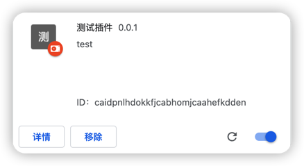

## chrome extension 开发介绍

chrome 插件开发和 web 开发差不多, 可以把插件看做一个 web 站点, 你有很多页面写在项目目录下, 所有文件都可以通过`chrome`协议的`extensions`路径访问.

chrome 通过项目目录下的`manifest.json`文件来识别 web 项目是否是`extension`插件, 如果配置合法, 就可以通过浏览器本地导入插件.

**首先新建 manifest.json**:

```json
{
  "manifest_version": 3,
  "version": "0.0.1",
  "description": "test",
  "name": "测试插件"
}
```

- name
  `必须填写`, 不然 chrome 无法加载插件
- manifest_version
  指明当前插件的 manifest 版本, 2023 年之后, 只支持 v3 版本的插件.
- version
  指明插件的版本, 每次修改或迭代, 都可以修改插件版本
- description
  插件的描述信息, 登录商店后方便介绍描述插件功能.

**新建 index.html**:

```html
<div>这是一个测试插件</div>
```

**本地导入插件**:
打开`chrome://extensions/`链接, 或者通过浏览器`插件栏`, 打开`管理扩展程序`.

进入管理页面后, 打开`开发者模式`, 点击`加载已解压的扩展程序`, 选择`插件目录`.



可以看见, `name`, `version`, `description`都显示在插件信息中, 由于没有指定插件的`icon`,所以浏览器使用插件的第一个字符生成了插件的`avatar`, 并且多出来了一个随机字符串, 也就是插件的`ID`, 每一个插件的`ID`都是`唯一`的.

**通过 chrome-extensions:// 协议访问插件目录**:

打开 chrome-extension://caidpnlhdokkfjcabhomjcaahefkdden/index.html 连接, 由于每一个插件的目录信息不一样, 所以并不能以此连接访问到所有插件的文件, 具体应参考不同插件的目录信息, 由于 chrome 规定, `manifest.json`必须放在插件跟目录下, 所以`chrome-extension://ID/manifest.josn`适用于所有插件.

**知晓 chrome 插件其实就是一个 web 站点之后, 就可以像 web 开发一样, 开发你需要的插件了.**
